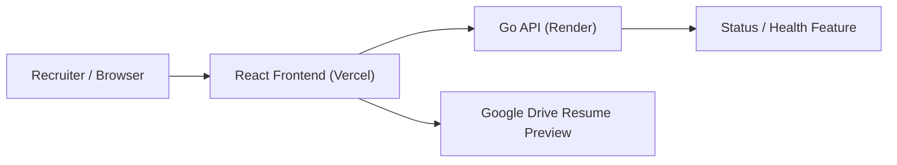

# Shadab Alam Portfolio

> Production-style engineering portfolio built as a deployable React frontend and Go backend, designed to communicate backend depth, product thinking, and measurable impact in under a minute.


## Why This Exists

This repository is intentionally built like a small production system instead of a static personal site.

It is meant to show:

- Strong backend-oriented engineering fundamentals
- Clear separation of concerns across frontend and backend layers
- Deployment readiness for real environments
- Measurable delivery narrative around scale, performance, and reliability

## What It Does

- Presents a recruiter-friendly portfolio landing page with a themed experience, resume preview, project highlights, and impact-focused experience sections
- Serves a lightweight Go API for health/status checks and future portfolio content expansion
- Supports deployment with Vercel for the frontend and Render for the backend

## Tech Stack

### Frontend

- React 18
- Webpack 5
- Modern CSS with theme tokens

### Backend

- Go
- Standard library `net/http`
- Structured logging with `log/slog`

### Delivery

- GitHub Actions CI
- Vercel configuration
- Render blueprint

## Feature Highlights

- Navy night theme and crimson day theme with a consistent tokenized color system
- Interactive resume stage driven by React state and CSS transforms
- Structured Go API with configuration, middleware, transport, feature, and response layers
- Request ID propagation and structured request logging in the backend
- Graceful shutdown and environment-driven runtime configuration
- Deployment-ready repository layout with CI and platform-specific config

## Architecture



### Repository Layout

```text
frontend/
  public/                  Static HTML, manifest, and metadata
  src/app/                 Application bootstrap
  src/features/portfolio/  Portfolio page, sections, and feature UI
  src/shared/              Shared constants, API helpers, and utilities

backend/
  cmd/api/                 Application entrypoint
  internal/app/            Server bootstrap and lifecycle management
  internal/config/         Environment configuration
  internal/httpapi/        Router, middleware, and transport tests
  internal/status/         Status feature service and handlers
  internal/web/            JSON response helpers

.github/workflows/         Continuous integration
render.yaml                Render deployment blueprint
frontend/vercel.json       Vercel routing and headers
```

## Local Setup

### Prerequisites

- Node.js 20+
- npm 10+
- Go 1.26+

### 1. Frontend

```bash
cd frontend
cp .env.example .env
npm ci
npm start
```

Frontend runs at [http://localhost:3000](http://localhost:3000).

### 2. Backend

```bash
cd backend
cp .env.example .env
go run ./cmd/api
```

Backend runs at [http://localhost:8000](http://localhost:8000).

## Environment Variables

### Frontend

| Variable | Required | Description |
| --- | --- | --- |
| `REACT_APP_API_URL` | No | Base URL for the Go API. Defaults to `http://localhost:8000` |

### Backend

| Variable | Required | Description |
| --- | --- | --- |
| `SERVICE_NAME` | No | Service name used in responses and logs |
| `APP_ENV` | No | Runtime environment label |
| `PORT` | No | HTTP server port |
| `CORS_ALLOW_ORIGIN` | No | Allowed frontend origin |
| `READ_TIMEOUT` | No | HTTP read timeout |
| `WRITE_TIMEOUT` | No | HTTP write timeout |
| `IDLE_TIMEOUT` | No | HTTP idle timeout |
| `SHUTDOWN_TIMEOUT` | No | Graceful shutdown timeout |

## API Endpoints

| Method | Route | Purpose |
| --- | --- | --- |
| `GET` | `/` | Portfolio API status payload |
| `GET` | `/health` | Health check |
| `GET` | `/api/status` | Explicit API status route |

## Quality Checks

```bash
cd backend && go test ./... && go build ./...
cd frontend && npm run build
```

CI runs the same validation on every push and pull request.

## Deployment

- Frontend: deploy `frontend/` to Vercel
- Backend: deploy `backend/` to Render
- Detailed instructions: [DEPLOYMENT.md](./DEPLOYMENT.md)

## Positioning Notes

If you are reviewing this repository as a hiring manager, the strongest signals are:

- impact-oriented experience framing instead of tool listing
- backend service organization that can scale beyond a toy API
- deployment and CI artifacts that make the project feel operational, not academic

## License

[MIT](./LICENSE)
